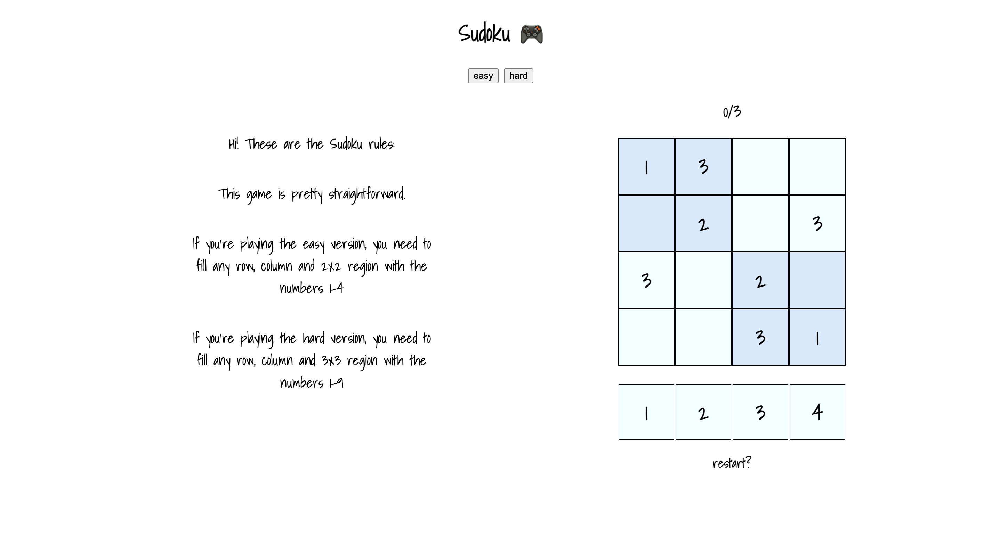
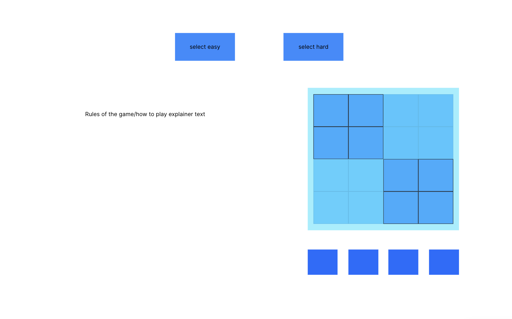

# GA Project One - Sudoku Game

<div align="center">

</div >

## Technologies Used

- HTML 5
- CSS
- JavaScript
- Git & Github (for version control and deployment)

## To Contribute

To contribute to this game, clone the repo and open the `index.html` file to view the game in the browser.

## The Brief

As project one, we were given 8 days to create a game of our choice, solo. The requirements were that we had to create separate HTML, CSS and JavaScript files and use DOM manipulation.

[Click Here To Play The Game](https://mafalda-hub.github.io/ga-project-1/)

## Overview & Concept

I decided to create a sudoku game. The original idea was for it to enable you to record your score so that you could beat your own time every time you played it.

## The Approach Taken

I decided to start small since it was my first project of all and I wanted to succeed at it.

I decided to break the project down into logical steps and set daily goals to help keep track of the progress throughout the build.

- Day 1 - Planning.

  - Before starting to write the code, I wanted to plan the project out so I could have a clear understanding of how the programme would run as well as how it would look. To do this, I created some basic wireframes.

<div align="center">
  
</div >

- Day 2 - Rendering the Grid.

  - I started to code the game on the 2nd day of the project. My goal for the day was to get the 4x4 grid rendered into the DOM using a JavaScript loop, according to the difficulty set by the user. Here's the code that I wrote to achieve this:

```js
//  create a function to get the correct grid, solution and gameboard to start the game
function setGame(mode) {
  let gameboard;
  const boardElement = document.getElementById('board');
  const digitsElement = document.getElementById('digits');
  if (mode === 'hard') {
    gridSize = 9;
    gameboard = hardboard;
    solution = hardsolution;
    boardElement.classList.replace('easy', 'hard');
    gameMode = 'hard';
    digitsElement.classList.replace('easydi', 'harddi');
  } else {
    gridSize = 4;
    gameboard = easyboard;
    solution = easysolution;
    boardElement.classList.remove('hard');
    boardElement.classList.add('easy');
    gameMode = 'easy';
    digitsElement.classList.remove('harddi');
    digitsElement.classList.add('easydi');
  }

  // available options
  for (let i = 1; i <= gridSize; i++) {
    const number = document.createElement('div');
    number.id = i;
    number.innerText = i;
    // calls the function selectNumber allowing you to click the numbers
    number.addEventListener('click', selectNumber);
    // add class to the div
    number.classList.add('number');
    document.getElementById('digits').appendChild(number);
  }

  // creates the board using as many divs as needed according the mode chosen
  for (let r = 0; r < gridSize; r++) {
    for (let c = 0; c < gridSize; c++) {
      // create div
      const tile = document.createElement('div');
      tile.id = r.toString() + '-' + c.toString(); //assigned id according to the position of the cells
      // removes the dash from the solution array
      if (gameboard[r][c] != '-') {
        tile.innerText = gameboard[r][c];
      }

      // everytime you click it calls de function selectTile
      tile.addEventListener('click', selectTile);
      // add class
      tile.classList.add('tile');
      // grab the id of the board and puts it together with tile
      document.getElementById('board').append(tile);
    }
  }
}
```

To define the boards, the game logic, and the cells/numbers that would appear in each of them, I wrote this code which would then be used as the gameboard variable:

```js
// STARTING BOARD
const easyboard = ['13--', '-2-3', '3-2-', '--31'];
const easysolution = ['1342', '4213', '3124', '2431'];
const hardboard = [
  '----1-2--',
  '74-59-6-3',
  '5---8----',
  '16---7-95',
  '837---4--',
  '95--43871',
  '3----5924',
  '41526----',
  '----3----',
];
const hardsolution = [
  '698314257',
  '741592683',
  '523786149',
  '164827395',
  '837951462',
  '952643871',
  '386175924',
  '415269738',
  '279438516',
];
```

- Day 3 - Gameplay

  - Day 3 of the build was time for the logic for the game play. I decided to add a condition that would give the player the option of resetting the game if they made 3 wrong moves in a row. This functionality was built into the logic for when a player selects a tile, so that they could be alerted as soon as the 3rd wrong move was made.

```js
function selectTile() {
  if (numSelected) {
    if (this.innerText !== '') {
      return;
    }
    const coords = this.id.split('-'); // splits the numbers in the arrays
    const r = parseInt(coords[0]); // turns the numbers into number and not strings
    const c = parseInt(coords[1]);

    if (solution[r][c] === numSelected.id) {
      this.innerText = numSelected.id;
    } else {
      // increases the errors everytime you make a mistake according to the solutions of the game
      // TO ADD: LIMIT OF 3 ERRORS
      errors += 1;
      updateScore(errors);
      if (errors >= 3) {
        updateScore('Game Over!');
        // after two seconds it restarts automatically
        setTimeout(() => {
          restartGame();
        }, 2000);
      }
    }
  }
}
```

Restarting the game would clear important variables such as the errors counter and rebuild the board.

```js
// create a board to start again in the same mode
function restartGame() {
  errors = 0;
  updateScore(errors);
  setMode(gameMode);
}
```

## Bugs, Blockers & Wins

After three wrong answers on each board, it shows a message of “game over '', that’s definitely a win. However, if you complete the board, it doesnt show a message saying “Congrats, you won!”, yet.

## Future Features & Key Learnings

- Random generator
- Set a timer
- Do a registration and login page so that we can save your own score and see if you can beat your best score
- When you’re playing on your desktop, it will allow you to select the numbers on your keyboard instead of selecting them from the options shown on your screen.
